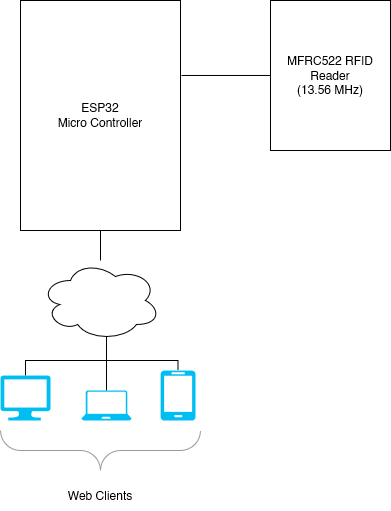

# RFID Attendance Logger
<small> 
    Adham Meligy - 900181762,
    Ahmad Shaaban - 900171600,
    Amr Abdelazeem - 900172775,
    Mohamed Mansour - 900172822,
</small>


---

## Circuit



---

## Microcontroller

--

```C++
MFRC522DriverPinSimple ss_pin(5); // initialize RFC
MFRC522DriverSPI driver{ss_pin}; 

AsyncWebServer server(80);  // Initialize webserver
AsyncWebSocket ws("/ws");


void loop()
{
  for (byte i = 0; i < mfrc522.uid.size; i++)  // read rfid uid
  {
    tagContent.concat(String(mfrc522.uid.uidByte[i] < 0x10 ? " 0" : " "));
    tagContent.concat(String(mfrc522.uid.uidByte[i], HEX));
  }

  tagContent.toUpperCase();

  ws.textAll(String(tagContent));
  tagContent = "";
  delay(1000);
}

```


---

## Web Client

--

### Data Storage

Currently stored as static JSON files:
```json
{
    "rfidData": {
        "AA AA AA AA":{
            "name": "FirstName LastName",
            "id": "9001111111"
        }, 
        "BB BB BB BB":{
            "name": "FirstName LastName",
            "id": "900222222"
        },
    }
}
```

---

## Progress & Next Steps

--

- [x] Interfaced RC522 with ESP32 Micro Controller
- [x] ESP32 broadcast RFIDs over websocket
- [x] Implemented minimal client to display attendance
 

--

- [ ] Add buzzer and LEDs to indicate circuit status
- [ ] Persistent storage for attendance data
- [ ] Battery power source
- [ ] Dynamically change ESP32's wifi credentials 

---

# Thank You